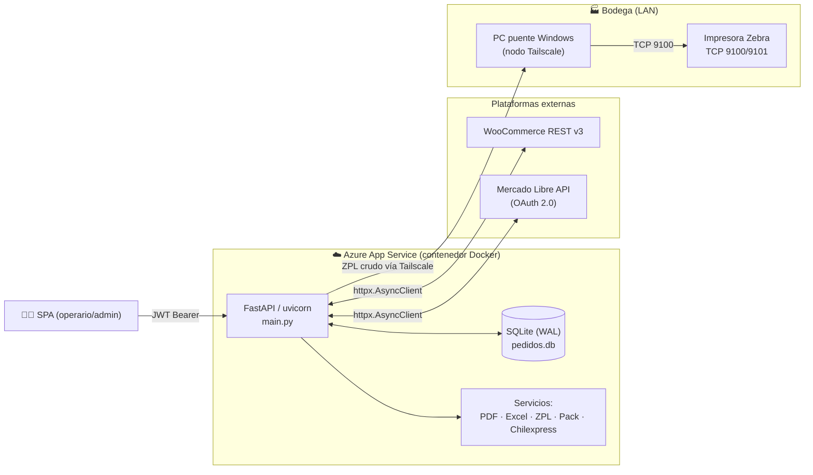
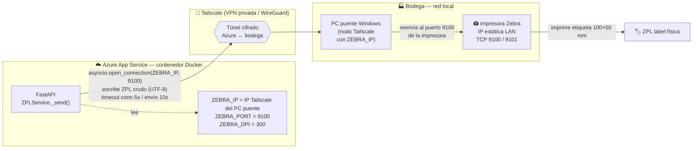
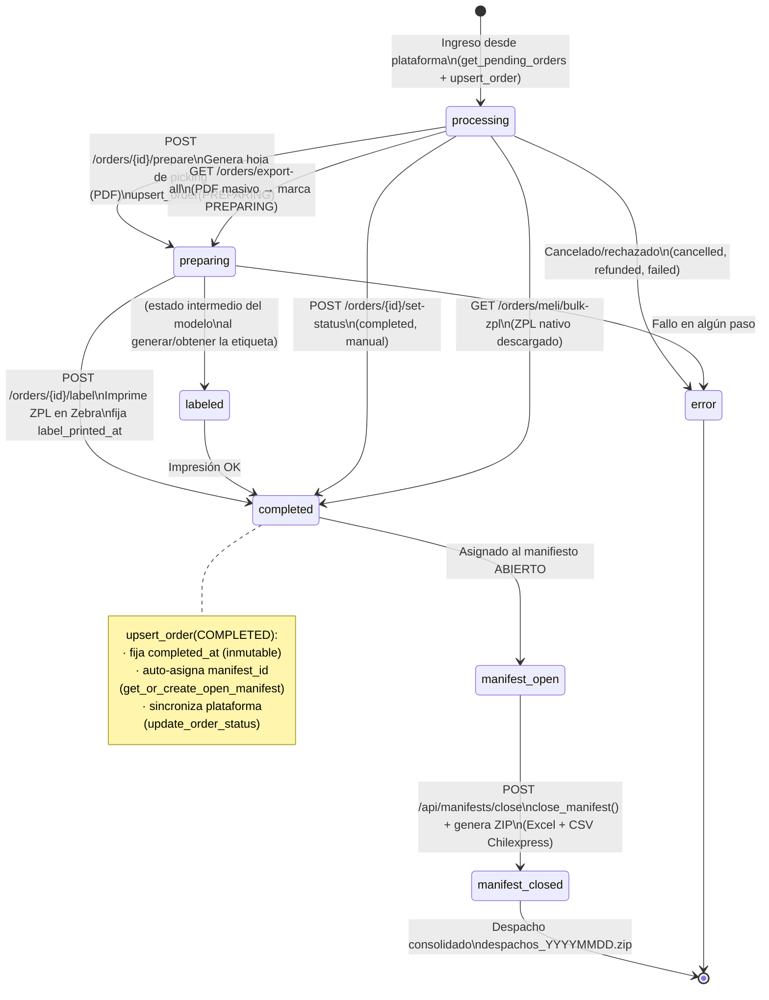

# ARCHITECTURE.md — UpperLogistics

> Mapa de flujos críticos y topología de red. Diagramas inferidos del código
> (`main.py`, `database.py`, `providers/`, `services/`). Ante divergencia con la
> documentación previa, **el código es la fuente de verdad**.

---

## 1. Visión general

UpperLogistics es un monolito FastAPI asíncrono desplegado como contenedor en
**Azure App Service**. Consolida pedidos de **WooCommerce** y **Mercado Libre**
en un modelo interno único (`NormalizedOrder`), los persiste en **SQLite**
(aiosqlite, WAL), genera **hojas de picking (PDF)**, imprime **etiquetas ZPL**
en una **Zebra** de la LAN a través de un **túnel Tailscale**, y agrupa los
despachos en **manifiestos** exportables a Excel + CSV Chilexpress.



---

## 2. Flujo de Sincronización (WooCommerce + Mercado Libre)

Punto de entrada principal: `GET /api/orders` (`list_orders` en `main.py`).
Cada proveedor implementa `BaseOrderProvider`; la app nunca conoce la forma
cruda de la plataforma — todo pasa por `normalize()`.

```mermaid
flowchart TD
    Start([GET /api/orders\noperario autenticado]) --> Loop{Por cada proveedor\nen PROVIDER_REGISTRY}

    Loop -->|WooCommerce| WooFetch["GET /wp-json/wc/v3/orders\nstatus=processing · paginado 50\nafter=2026-01-01"]
    Loop -->|Mercado Libre| MeliSearch["GET /orders/search\nstatus=paid · tags=not_delivered\nventana 30 días · paginado"]

    WooFetch --> WooNorm["normalize():\nWOO_STATUS_MAP → OrderStatus\nshipping/billing → ShippingAddress"]

    MeliSearch --> Enrich["Enriquecer en paralelo (asyncio.gather):\n/shipments/{id} → estado real\nPII Guard → /billing_info\n(solo si NO shipped/delivered/cancelled)"]
    Enrich --> MeliFilter{logistic_type\n== fulfillment?}
    MeliFilter -->|Sí: pedido Full| Skip["Omitir\n(MeLi lo gestiona)"]
    MeliFilter -->|No| MeliNorm["normalize():\nreceiver_address → ShippingAddress\nbilling_info.doc_number → RUT\nshipping_status → status interno"]

    WooNorm --> LocalStatus["get_local_status(id, source)"]
    MeliNorm --> LocalStatus

    LocalStatus --> Reconcile{¿Estado local\nexistente?}
    Reconcile -->|"Woo + local != processing"| Drop["Excluir de la cola\n(ya en preparación)"]
    Reconcile -->|"MeLi con estado local"| Preserve["Preservar estado local\n(p.ej. completed en verde)"]
    Reconcile -->|Sin estado local| Keep["Usar estado de la plataforma"]

    Preserve --> Upsert
    Keep --> Upsert["upsert_order()\nINSERT ... ON CONFLICT(id,source)\nDOUPDATE (no degrada estados\navanzados; preserva timestamps)"]
    Upsert --> PackEnrich["enrich_order_with_pack_info()\ndesglose de Packs/Mixes\ndesde data/skus.json"]
    PackEnrich --> Collect[Agregar a respuesta]

    Collect --> MorePrep["+ get_preparing_orders()\nWooCommerce preparing/labeled\n(recuperación de hojas perdidas)"]
    MorePrep --> Resp([JSON: orders[] + errors[]\nerrores parciales NO bloquean])

    Skip --> Loop
    Drop --> Loop
```

**Puntos clave del código:**

- **Normalización:** `WOO_STATUS_MAP` / `_MELI_STATUS_MAP` traducen estados de
  plataforma a `OrderStatus`. Para MeLi, el `shipping_status` real
  (`shipped`/`delivered`/`dropped_off` → `completed`; `cancelled` → `error`)
  sobrescribe el estado tras enriquecer.
- **Persistencia idempotente:** `upsert_order` usa
  `INSERT ... ON CONFLICT(id, source) DO UPDATE` y **nunca degrada** un pedido
  ya `preparing`/`labeled`/`completed` a `processing`; `completed_at` y
  `label_printed_at` se preservan una vez fijados.
- **PII Guard (MeLi):** `billing_info` solo se consulta si el envío sigue
  activo; los `403` por PII revocada son esperados y se loguean en DEBUG.
- **Resiliencia:** un fallo de un proveedor se acumula en `errors[]` sin abortar
  la respuesta global.
- **OAuth MeLi:** el flujo de autorización persiste tokens en `meli_tokens`
  (`GET /api/meli/callback` → `exchange_code`). El `access_token` se refresca
  perezosamente (`_ensure_valid_token` / `_do_refresh`, margen de 5 min) y ante
  un `401` se reintenta una vez.

---

## 3. Topología de Red e Impresión ZPL

La app corre en **Azure** (nube) pero la impresora **Zebra** vive en la **LAN**
de la bodega. La comunicación es híbrida vía un **túnel Tailscale**.



**Detalles de implementación (`services/zpl_service.py`):**

1. **Túnel seguro:** Tailscale crea una red privada (WireGuard) que conecta la
   VM/contenedor de Azure con el PC puente de la empresa.
2. **Enrutamiento desde Azure:** en el servidor, `ZEBRA_IP` apunta a la IP que
   Tailscale asignó al PC puente. El contenedor abre un socket TCP a
   `ZEBRA_IP:ZEBRA_PORT` (9100 por defecto; 9101 en algunas instalaciones).
3. **Recepción y ZPL:** la app envía **texto ZPL crudo** (no hay PostScript ni
   driver de impresora). El PC puente Windows recibe la conexión y la redirige a
   la Zebra (IP estática LAN, escucha en 9100/9101).
4. **Origen del ZPL:**
   - **WooCommerce / manual:** se **genera localmente** con `build_zpl_main` y
     (si hay nota) `build_zpl_note` — etiqueta 100×50 mm, escala dinámica según
     contenido, texto sanitizado con `_safe()`.
   - **Mercado Libre:** se obtiene el **ZPL nativo** de MeLi
     (`get_native_zpl` → `GET /shipment_labels?response_type=zpl2`); MeLi puede
     devolver un ZIP que se descomprime para extraer el `.txt`. Requiere envío en
     estado `ready_to_ship`.
5. **Sin estado persistente:** cada impresión abre y cierra su propia conexión
   TCP (equivalente a una app de escritorio). Si la impresora está offline,
   `_send` devuelve `(False, mensaje)` **sin lanzar excepción**; el endpoint
   responde `503` con el detalle.
6. **`docker-compose.yml`** usa `network_mode: host` solo para el escenario de
   bodega local (impresora directamente visible); en Azure se usa el túnel.

---

## 4. Ciclo de Vida de Pedidos y Manifiestos

Estados en `OrderStatus`. Las acciones de bodega (`/prepare`, `/label`) y el
cierre de manifiesto (`/api/manifests/close`) gobiernan las transiciones.



**Reglas de negocio de manifiestos (`database.py`):**

- Existe **a lo sumo un** manifiesto `open`. Al completar un pedido sin
  `manifest_id`, `get_or_create_open_manifest` lo crea o reutiliza.
- `manifest_id` y los timestamps (`completed_at`, `label_printed_at`) son
  **inmutables** una vez fijados (lógica `CASE` en el `ON CONFLICT`).
- `migrate_orphan_orders` agrupa pedidos `completed` sin manifiesto en un
  manifiesto histórico **cerrado** retroactivo al iniciar la app.
- **Cierre (`POST /api/manifests/close`):** valida que el manifiesto abierto
  exista y no esté vacío, lo marca `closed`, y devuelve un **ZIP**
  (`despachos_YYYYMMDD.zip`) con:
  - `planilla_despachos.xlsx` (todos los pedidos, excluye Full),
  - `chilexpress_regional.csv` (**solo** WooCommerce regional; MeLi se excluye
    explícitamente con warning de auditoría).

---

## 5. Modelo de datos (SQLite)

| Tabla | Propósito | Notas |
|-------|-----------|-------|
| `orders` | Pedidos normalizados | PK `(id, source)`; `payload_json` = `NormalizedOrder` serializado; columnas `completed_at`, `label_printed_at`, `manifest_id` (migraciones). |
| `order_events` | Auditoría de eventos | `prepare`, `label_printed`, `bulk_export`, `manifest_closed`, `skus_updated`, etc. |
| `meli_tokens` | Tokens OAuth de MeLi | Registro único (`CHECK id = 1`); `access_token`, `refresh_token`, `expires_at`, `seller_id`. |
| `manifests` | Lotes de despacho | `status ∈ {open, closed}`. |
| `users` | Cuentas | `role ∈ {admin, user}`; password bcrypt; `token_version` (revocación de JWT). |

`PRAGMA journal_mode=WAL`, `synchronous=NORMAL`, `busy_timeout=5000`. Conexión
única compartida (`_ensure_db_connection`) cerrada en el shutdown del `lifespan`.

---

## 6. Mapa de endpoints (referencia rápida)

| Método | Ruta | Función |
|--------|------|---------|
| `GET` | `/` | SPA frontend |
| `GET` | `/api/health` | Health check (Azure/Docker) |
| `POST` | `/api/login` | Login → JWT |
| `POST` | `/api/logout` | Logout-all (incrementa `token_version`) |
| `GET/POST/PUT/DELETE` | `/api/users…` | Gestión de usuarios (**admin**) |
| `GET/PUT` | `/api/skus`, `/api/skus/audit` | Catálogo de Packs/SKUs (PUT = **admin**, con backup + auditoría) |
| `GET` | `/api/orders` | Cola de pedidos (todos los proveedores) |
| `GET` | `/api/orders/export-all` | PDF masivo de picking → marca PREPARING |
| `GET` | `/api/orders/export-excel` | Reporte Excel de completados |
| `GET` | `/api/orders/{id}` | Detalle de pedido |
| `GET` | `/api/orders/{id}/zpl` | ZPL como `.txt` (contingencia) |
| `POST` | `/api/orders/{id}/set-status` | Cambio manual de estado |
| `POST` | `/api/orders/{id}/prepare` | Genera hoja de picking (PDF) |
| `POST` | `/api/orders/{id}/label` | Imprime etiqueta ZPL + completa |
| `GET` | `/api/orders/meli/bulk-zpl` | ZPL nativo masivo de MeLi |
| `GET` | `/api/orders/meli/bulk-pdf` | PDF picking masivo de MeLi |
| `GET` | `/api/meli/callback` | Callback OAuth de MeLi |
| `GET` | `/api/printer/test` | Diagnóstico de la Zebra |
| `POST` | `/api/manifests/close` | Cierra manifiesto → ZIP (Excel + CSV) |
| `GET` | `/api/manifests/current` | Info del manifiesto abierto |

Todos los endpoints `/api/*` (salvo `/api/health`, `/api/login` y `/`) exigen
JWT Bearer vía `get_current_user`; los de administración añaden `get_admin_user`.
